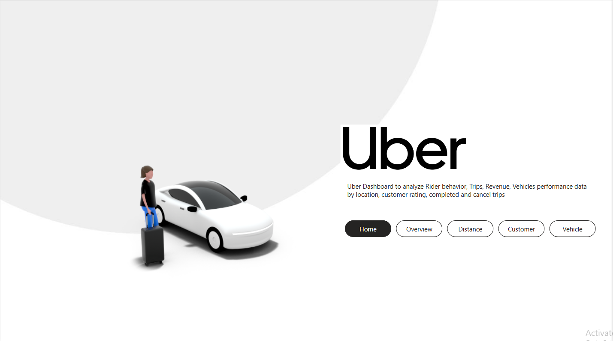
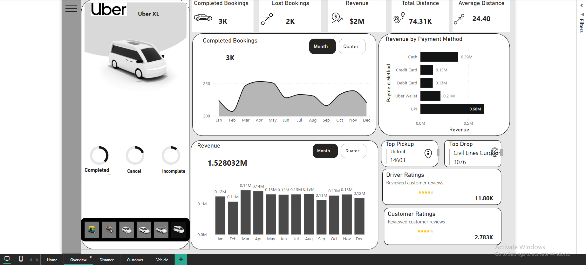
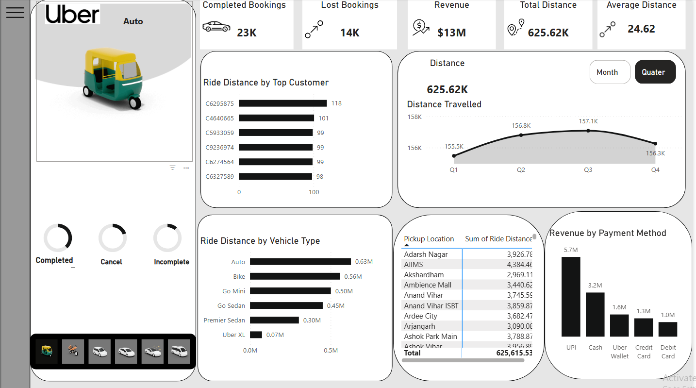
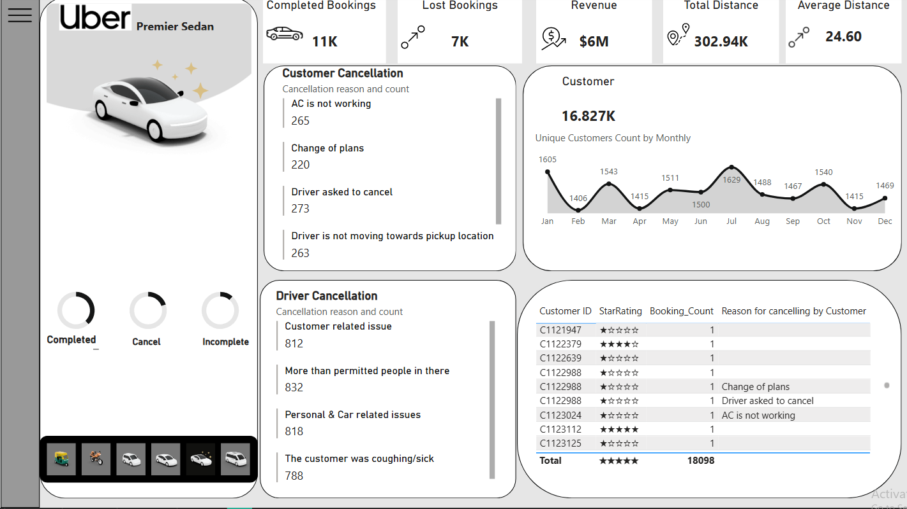
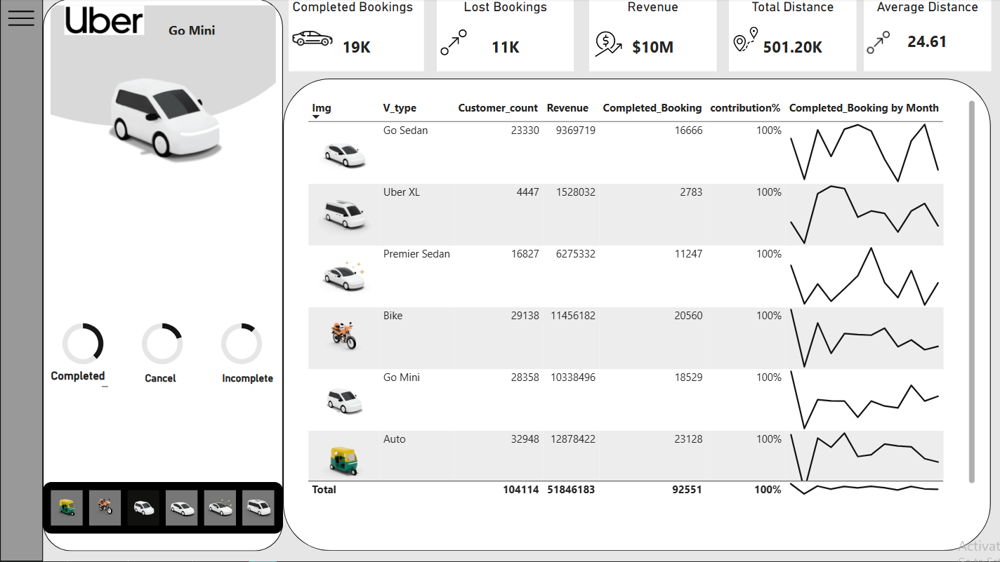

# Uber_Cab_Analytics

This repository contains a Power BI dashboard built to analyze ride-hailing performance patterns across booking behavior, cancellation reasons, payment preferences, customer feedback, and fleet categories.

The analysis supports operational decisions related to demand concentration, route planning, cancellation mitigation, and experience improvement for riders and drivers.

---

## Key Objectives
- Track completed and cancelled bookings across time periods
- Evaluate revenue contribution and payment channel usage
- Monitor rider distance behavior and high-distance customers
- Compare performance across vehicle types (Auto, Bike, Sedan, XL, Mini)
- Review customer and driver ratings
- Analyze monthly and quarterly patterns

---

## Main Insights
- Evening hours show approximately 27% higher ride activity than morning hours
- UPI and wallet transactions represent strong payment adoption
- Core pickup clusters reflect high-density urban mobility zones
- Recurring cancellation themes involve route concerns, plan changes, and capacity issues
- Sedan and Mini categories demonstrate consistent booking patterns

---

## Technology Stack
| Component | Tool |
|---|---|
BI Platform | Power BI Desktop  
Data Shaping | Power Query  
Data Logic | DAX  
Data Storage | CSV source file  
Processing Support | SQL for cleansing and transformations  

---

## Dashboard Workflow
1. Import dataset into Power BI
2. Use Power Query to clean and format fields
3. Build calculations and KPIs with DAX
4. Create interactive pages for:
   - Overview
   - Distance
   - Customer
   - Vehicle category insights
5. Add navigation buttons, filters, and visuals

## Screenshots and Page Overview

### Home Page
The landing page outlining the dashboard objective and navigation buttons for all analytical modules. It introduces the focus areas such as trip behavior, revenue, customer experience, and vehicle performance.

---

### Overview Page
A consolidated performance view showing key operating metrics including completed vs lost trips, revenue, total distance, and average trip distance. This page also visualizes payment method usage, monthly ride patterns, ratings, and top pickup/drop locations.

**Key Highlights**
- Booking completion vs cancellation
- Monthly revenue trend
- Payment channel distribution (UPI, wallet, cash, card)
- Customer and driver rating summary
- High-frequency pickup and drop zones

---

### Distance Analysis Page
This page focuses on distance-based travel insights including top riders by travel distance, category-wise distance contribution, and distance trends across quarters. Pickup locations are ranked by distance served, along with payment contribution visuals.

**Key Highlights**
- High-distance rider identification
- Ride distance by vehicle category
- Quarterly distance trend line
- Pickup clusters supporting heavy travel routes

---

### Customer Insights Page
This view analyzes customer behavior, cancellation reasons, and monthly user activity. It includes customer and driver cancellation reasons and a detailed table of customer trips with ratings.

**Key Highlights**
- Customer cancellation drivers (plan change, driver route issues)
- Driver cancellation reasons (capacity issues, customer behavior)
- Monthly active customer count
- Star rating distribution

---

### Vehicle Performance Page
Performance comparison across vehicle types (Auto, Bike, Mini, Sedan, XL). It presents revenue, booking counts, completion contribution, and time-series booking trends by category.

**Key Highlights**
- Customer count per category
- Revenue contribution by vehicle type
- Completion count and booking trend by month
- Fleet contribution overview

---

## Key Findings

The dashboard highlights operational and user behavior patterns across trip performance, customer experience, and fleet utilization in a ride-hailing environment.

### Demand and Trip Completion
- Evening period activity shows an increase of approximately **27 percent** compared to morning periods, reflecting stronger demand later in the day.
- Completed bookings consistently exceed cancelled and incomplete trips across all vehicle categories, indicating reliable service fulfillment.

### Revenue and Payment Behavior
- Revenue trends remain steady across months with visible periodic variation.
- **UPI and wallet payments** are the most utilized payment modes, reflecting strong adoption of digital transactions.
- Premium ride categories yield higher revenue per booking, while auto and bike categories achieve scale through trip volume.

### Distance and Travel Patterns
- Average trip distance is around **24–25 km**, showing medium-range mobility behavior.
- Certain customers travel significantly higher total distances, indicating a segment of frequent riders with strong platform usage.

### Customer and Driver Experience
- Customer-initiated cancellations commonly involve route concerns or change of plans.
- Driver-initiated cancellations frequently relate to passenger capacity issues or customer behavior challenges.
- Rating data trends suggest favorable rider-driver interaction quality with most trips earning high star ratings.

### Location Insights
- Dense pickup zones (for example, Jhilmil and Adarsh Nagar) serve as key rider hubs.
- Drop-off patterns concentrate around commercial and transit clusters.

### Vehicle Category Performance
- **Sedan, Mini, and Auto** categories show consistent ride contribution.
- **Uber XL and Premier Sedan** deliver lower ride volume but higher revenue intensity.
- **Bike** rides support short-distance commuting with high booking count.

Overall, the dashboard provides data-driven insight into demand cycles, payment preferences, trip distance behavior, rider satisfaction, and fleet utilization effectiveness.

## 🔗 Author
Reshmitha Marupaka   
[LinkedIn](https://www.linkedin.com/in/reshmitham/) | GitHub: https://github.com/ReshmithaMarupaka24
 

